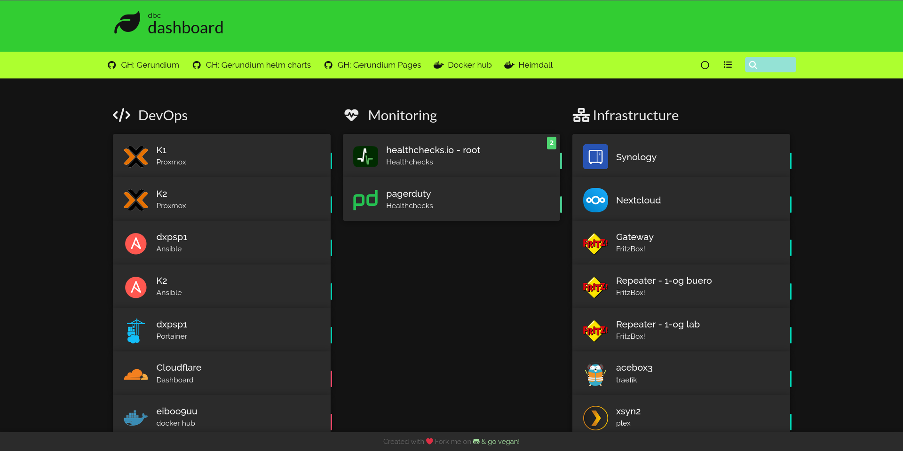

# Homer

## Info

A dead simple static HOMepage for your servER to keep your services on hand, from a simple yaml configuration file.

***SOURCE***: https://github.com/bastienwirtz/homer

[](https://github.com/bastienwirtz/homer)

- [Install Homepage Dashboard on Kubernetes](https://github.com/bastienwirtz/homer?tab=readme-ov-file#getting-started)

## TL;DR;

### Step-by-step approach

1. Deploy helm chart
```bash
helm repo add gerundium https://gerundium.github.io/helm-charts
helm install <MY-RELEASE-NAME> gerundium/<CHART-NAME> [--values=overrides.yaml]
```